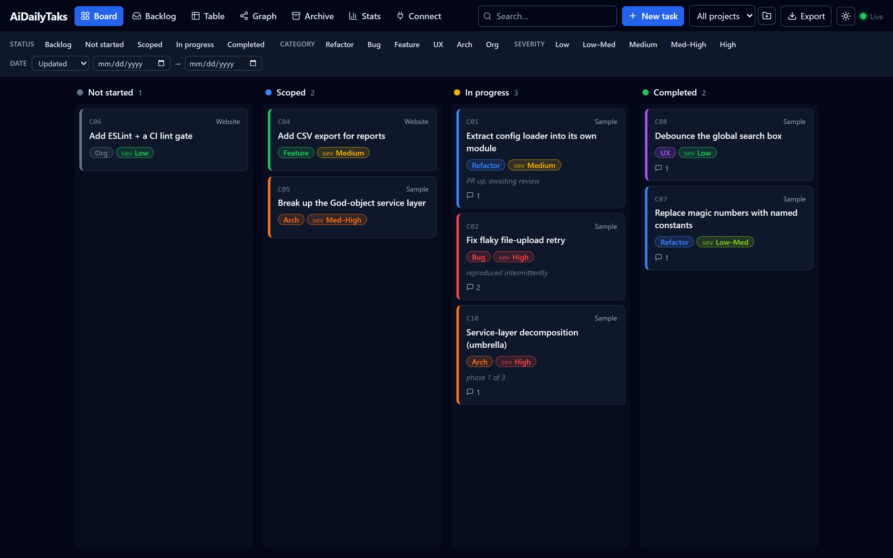
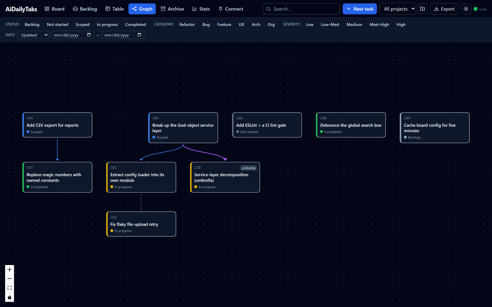
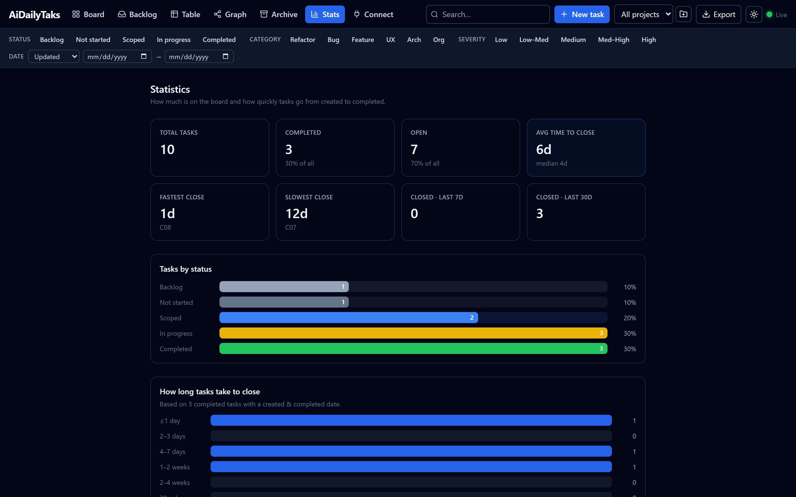
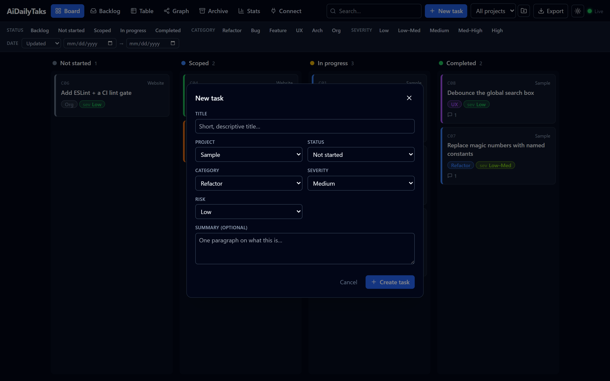
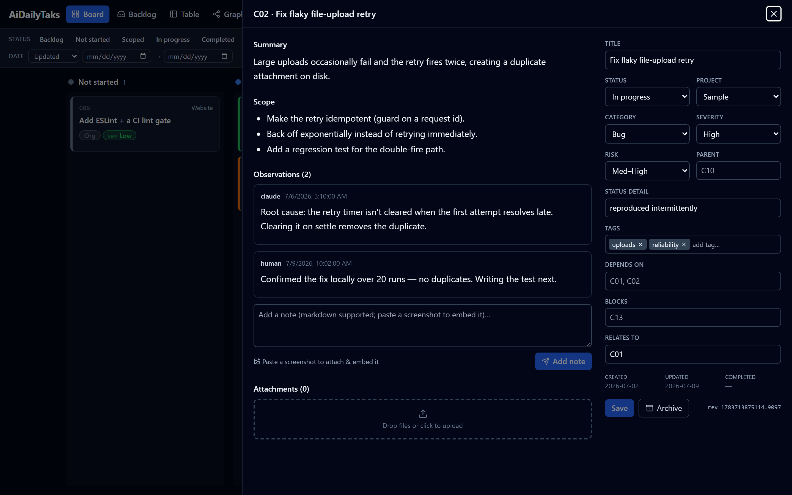
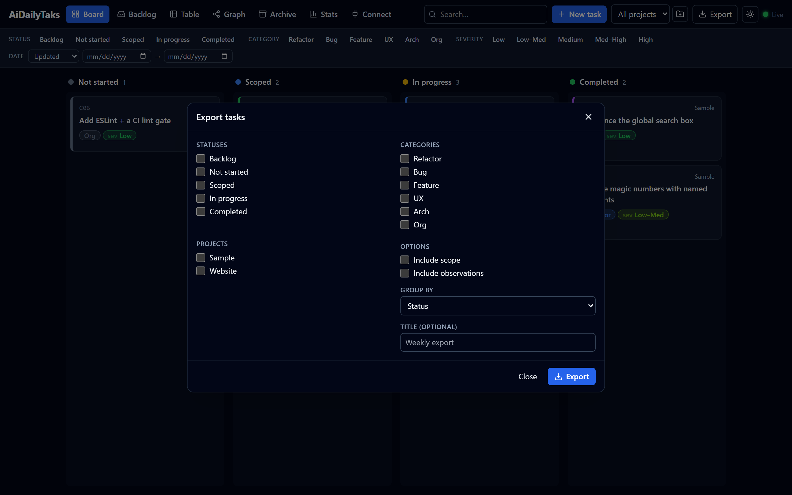

# AiDailyTaks

**A local, file-based task board that a human and an AI agent manage together — one Markdown file per task, edited live from both sides.**



> The screenshots in this README are of a small **sample** board included for illustration; your own
> task data stays local and git-ignored.

---

## Why this exists

This started in the middle of a long refactor of a legacy codebase. The work was dozens of
interrelated things — code-smell fixes, bugs, small architectural changes — and I was tracking it
in one sprawling Markdown file, propped up by a litter of `SCOPE-*` and `DRAFT-*` notes that kept
getting committed *inside the very repo I was trying to clean up.*

Two problems compounded:

1. **The notes polluted the codebase.** Planning docs and back-and-forth between me and the AI
   agent don't belong in a shared source repo, but that's where they kept landing because there was
   nowhere better to put them.
2. **The agent had no memory of the plan.** Every session with the AI coding agent started from a
   blank slate. It couldn't *see* the board, so I was re-pasting status, priorities, and history by
   hand — and the moment the conversation ended, that context evaporated.

I wanted a single place — **outside** the code repo — that both of us could treat as the source of
truth: something I could glance at in a browser like a normal Kanban board, and something the agent
could read and update *directly*, without an API dance or losing context between sessions.

## The idea

The whole design falls out of one decision: **the files are the database.**

Each task is a folder with a `task.md` (YAML frontmatter + a Markdown body) and an optional
`files/` directory for attachments. That single choice buys almost everything:

- **The human** gets a live web UI — a drag-and-drop board, filters, a dependency graph, stats.
- **The agent** doesn't need an integration. It reads and writes plain Markdown with the same file
  tools it already has. A file watcher pushes those edits to the browser instantly, so you *watch*
  the agent move cards and log notes in real time.
- **Nothing is locked in.** The board is also a valid [Obsidian](https://obsidian.md) vault. Your
  data is greppable, diffable, and portable — no proprietary format, no cloud, no account.
- **It stays private.** Task and project data are git-ignored by default; only the code and a small
  vocabulary template are ever committed.

The result is shared, durable, structured context for human + agent work — the thing that was
missing when all I had was a chat window and a giant text file.

## What you get

- **Board** — drag-and-drop Kanban across your workflow states (Backlog · Not started · Scoped · In
  progress · Completed), with an auto-archiving Completed column so it never sprawls.
- **Table, Backlog, Archive** views — sortable table, a parked-work backlog, and restorable archive.
- **Dependency graph** — tasks link via `depends_on` / `blocks` / `relates_to` / `parent`, rendered
  as an auto-laid-out graph so you can see the shape of the work.
- **Stats** — cycle time, throughput, and how long things sit open.
- **Rich task detail** — Markdown summary + scope, a timestamped observations log, and attachments
  (paste a screenshot straight into a note and it's saved and embedded).
- **Filters, search, projects, and one-click Markdown export.**
- **Live sync** via server-sent events, with optimistic concurrency + atomic writes so the UI and
  the agent can edit the same task without clobbering each other.

The **dependency graph** and **stats** views:





## Quick start

```bash
npm install            # once, from the repo root (npm workspaces)
npm run dev            # server on :4317 + Vite UI on :5173
```

Open **http://localhost:5173**, create a task, and you're running. For daily use without the dev
server:

```bash
npm run build          # build the web UI
npm start              # serve UI + API together on http://localhost:4317
```

Optionally, seed a board from an existing Markdown doc (a status table + per-task sections):

```bash
npm run import:dry     # preview the plan — writes nothing
npm run import -- --source path/to/your-doc.md
```

The importer is idempotent and never modifies your source file. A fresh board works fine without it.

## Using the board

Everything below happens at **http://localhost:5173** (dev) or **http://localhost:4317** (`npm start`).
The top bar has your views, search, the project picker, **New task**, and **Export**.

### Create a task

Click **New task** (top bar). Give it a title, pick the project, status, category, severity, and risk,
and optionally a one-paragraph summary. Press **Create** (or ⌘/Ctrl + Enter). The server assigns the
next id automatically (`C01`, `C02`, …) and opens the new task so you can flesh it out.

Every task is written to `board/<ID>/task.md` on disk the moment you create it — no save step, no
database.



### Work a task

- **Change status:** on the **Board**, drag a card between columns. That rewrites the task's `status`
  and (for Completed) stamps the completion date.
- **Open the details:** click any card (or a row in the **Table**) to open the task drawer. There you
  can edit the title, all the metadata, the Markdown **Summary** and **Scope**, and the relationship
  fields (`depends_on`, `blocks`, `relates_to`, `parent` — comma-separated ids like `C01, C02`). Click
  **Save** to write it back.
- **Log progress:** add a note in the **Observations** box — it's appended with a timestamp and
  author, newest last, so a task carries its own history.
- **Attach files:** drag files onto the drawer's upload area, or **paste a screenshot directly into an
  observation** — it's saved under `board/<ID>/files/` and embedded inline in the note.
- **Archive / restore:** finished tasks auto-archive after a while (configurable in
  `board.config.json`), or archive one by hand from the drawer. The **Archive** view lists them and
  restores with one click.



### Create a project

Click the **＋** next to the project picker in the top bar, type a name, and confirm. Projects are
stored in the local, git-ignored `projects.json` (`[{ "id", "label" }]`); you can also edit that file
by hand and the browser refreshes live. Switch the active project from the same picker (or **All
projects**), and it scopes every view and filter.

### Find things

- **Search:** the top-bar box filters by text (debounced).
- **Filters:** the filter bar toggles by status, category, severity, and a created/updated/completed
  date range. **Clear** resets them.
- **Views:** **Board** (Kanban), **Backlog** (parked work), **Table** (sortable), **Graph**
  (dependency map), **Archive**, **Stats**, and **Connect** (MCP setup).

### Export to Markdown

Click **Export** (top bar) to open the export dialog. Choose which statuses / categories / projects to
include, whether to include scope and observations, and how to group the output (by status, category,
project, or none). Click **Export** and it:

1. writes a timestamped `.md` file into `exports/` (git-ignored), and
2. shows a preview with a **Download** button to save a copy anywhere.

Recent exports are listed at the bottom of the dialog. Handy for sharing a status snapshot or pasting
a filtered slice of the board into a report.



### Let an agent drive it

Because tasks are plain files, any file-editing agent can create tasks, update status, and log
observations directly — see [Connect any AI agent (MCP)](#connect-any-ai-agent-mcp) below for the
structured-tools path, and [AGENTS.md](AGENTS.md) / [CLAUDE.md](CLAUDE.md) for the conventions an agent
should follow.

## How it's laid out

```
board/<ID>/task.md     a task: YAML frontmatter + Markdown body            [git-ignored — private]
board/<ID>/files/      that task's attachments (logs, screenshots, docs)   [git-ignored — private]
board/_meta/           overview / relationships / import report            [git-ignored — private]
exports/               generated Markdown exports                          [git-ignored — private]
projects.json          your project list ({id,label}) — add via the UI     [git-ignored — private]
board.config.json      the vocabulary (statuses, categories, colors) — tracked template
app/shared/            zod contract + shared TypeScript types (server + web)
app/server/            Fastify + TypeScript API, file watcher, MCP server, importer
app/web/               React + Vite + TypeScript frontend
```

> **Your data is private by default.** `board/`, `exports/`, and `projects.json` are git-ignored, so
> nothing you track ever lands in git — only the code and the `board.config.json` vocabulary
> template are version-controlled.

## Connect any AI agent (MCP)

AiDailyTaks is also an **MCP server**, so an agent gets structured tools — `list_tasks`, `get_task`,
`create_task`, `update_task`, `add_observation`, `archive_task` / `unarchive_task`, `list_projects`,
`add_project`, `get_config`, `get_graph` — over either transport.

Because it's built on the open [Model Context Protocol](https://modelcontextprotocol.io) **and** on
plain files, it isn't tied to any one assistant: MCP-capable agents (Claude, and other MCP clients)
can use the tools, while *any* file-editing agent can drive the board just by reading and writing
the `board/` Markdown directly.

> **In-app helper:** open the **Connect** tab in the UI for copy-paste configs (HTTP + stdio) and
> the live tool list, filled in from the running server.

**Option A — HTTP (server already running).** Comes up automatically with `npm run dev` / `npm start`.
Point any Streamable-HTTP MCP client at:

```
http://127.0.0.1:4317/mcp
```

**Option B — stdio (the agent spawns it, no HTTP server needed).** Example client config
(`.mcp.json`, `claude_desktop_config.json`, or equivalent):

```jsonc
{
  "mcpServers": {
    "AiDailyTaks": { "command": "npm", "args": ["run", "mcp"], "cwd": "/absolute/path/to/AiDailyTaks" }
  }
}
```

Or run it directly with `npm run mcp`. Either path edits the same `board/` files with the same
optimistic-concurrency + atomic writes as the web UI, so the browser updates live.

**Once it's connected**, you don't call the tools by hand — just ask your agent in plain language,
e.g. *"add a Bug task for the flaky upload retry, high severity,"* *"move C12 to In progress and note
what you tried,"* or *"list everything still open in the Sample project."* The agent picks the right
tool, and you watch the board update live in the browser.

## Working conventions

See [AGENTS.md](AGENTS.md) (any agent) or [CLAUDE.md](CLAUDE.md) (Claude Code) for how an agent is
expected to work with the board — the frontmatter schema, how to keep relationships consistent, and
the guiding rule: **scope and tracking notes are created here as tasks, not scattered across the
codebase you're working on.**

## Tech

TypeScript end to end — React + Vite (web), Fastify (API), a shared zod contract, and an MCP server,
in an npm-workspaces monorepo. No database; the filesystem is the store.
