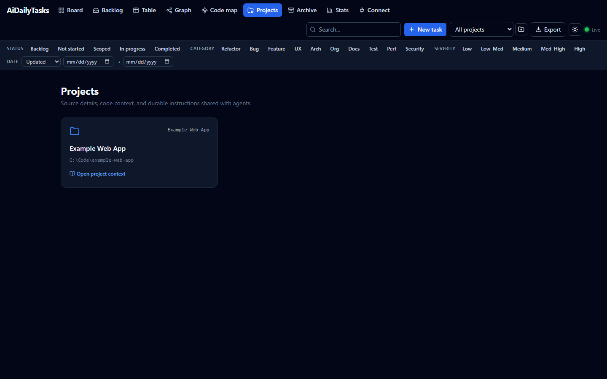
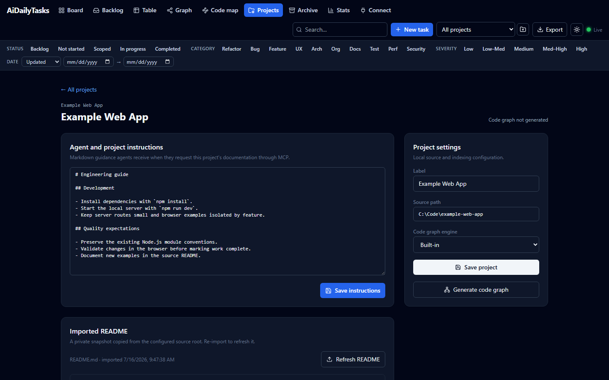
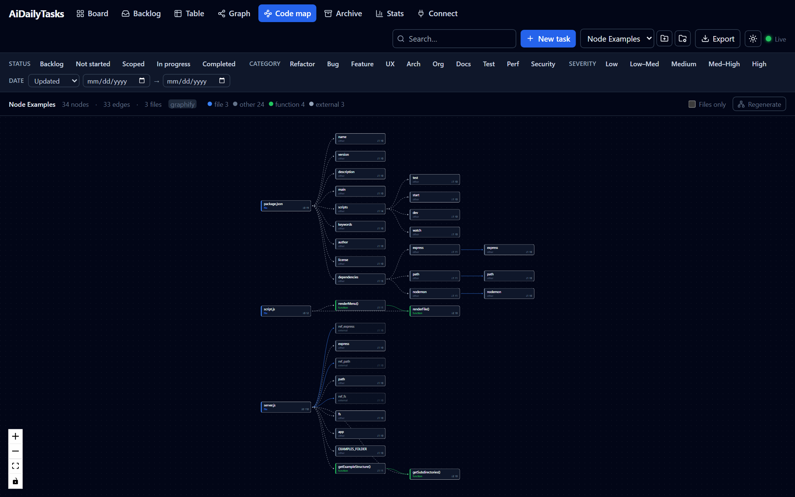

# AiDailyTasks

**A local, file-based task board that a human and an AI agent manage together — one Markdown file per task, edited live from both sides.**


> The screenshots in this README are of a small **sample** board included for illustration; your own
> task data stays local and git-ignored.

---

## Why this exists

This started in the middle of a long refactor of a legacy codebase. The work was dozens of
interrelated things — code-smell fixes, bugs, small architectural changes — and I was tracking it
in one sprawling Markdown file, propped up by a litter of `SCOPE-*` and `DRAFT-*` notes that kept
getting committed *inside the very repo I was trying to clean up.*

Two problems compounded:

1. **The notes polluted the codebase.** Planning docs and back-and-forth between me and the AI
   agent don't belong in a shared source repo, but that's where they kept landing because there was
   nowhere better to put them.
2. **The agent had no memory of the plan.** Every session with the AI coding agent started from a
   blank slate. It couldn't *see* the board, so I was re-pasting status, priorities, and history by
   hand — and the moment the conversation ended, that context evaporated.

I wanted a single place — **outside** the code repo — that both of us could treat as the source of
truth: something I could glance at in a browser like a normal Kanban board, and something the agent
could read and update *directly*, without an API dance or losing context between sessions.

## The idea

The whole design falls out of one decision: **the files are the database.**

Each task is a folder with a `task.md` (YAML frontmatter + a Markdown body) and an optional
`files/` directory for attachments. That single choice buys almost everything:

- **The human** gets a live web UI — a drag-and-drop board, filters, a dependency graph, stats.
- **The agent** doesn't need an integration. It reads and writes plain Markdown with the same file
  tools it already has. A file watcher pushes those edits to the browser instantly, so you *watch*
  the agent move cards and log notes in real time.
- **Nothing is locked in.** The board is also a valid [Obsidian](https://obsidian.md) vault. Your
  data is greppable, diffable, and portable — no proprietary format, no cloud, no account.
- **It stays private.** Task and project data are git-ignored by default; only the code and a small
  vocabulary template are ever committed.

The result is shared, durable, structured context for human + agent work — the thing that was
missing when all I had was a chat window and a giant text file.

## What you get

- **Board** — drag-and-drop Kanban across your workflow states (Backlog · Not started · Scoped · In
  progress · Completed), with an auto-archiving Completed column so it never sprawls.
- **Table, Backlog, Archive** views — sortable table, a parked-work backlog, and restorable archive.
- **Dependency graph** — tasks link via `depends_on` / `blocks` / `relates_to` / `parent`, rendered
  as an auto-laid-out graph so you can see the shape of the work.
- **Code map** — point a project at its source tree and turn it into a dependency/call graph
  (a fast built-in scanner, or the richer [graphify](https://github.com/safishamsi/graphify) engine),
  stored git-ignored and queryable by your agent over MCP so it can navigate a codebase by structure
  instead of re-reading every file.
- **Stats** — cycle time, throughput, and how long things sit open.
- **Rich task detail** — Markdown summary + scope, a timestamped observations log, and attachments
  (paste a screenshot straight into a note and it's saved and embedded).
- **Filters, search, projects, and one-click Markdown export.**
- **Live sync** via server-sent events, with optimistic concurrency + atomic writes so the UI and
  the agent can edit the same task without clobbering each other.

The **dependency graph** and **stats** views:


## Quick start

```bash
npm install            # once, from the repo root (npm workspaces)
npm run dev            # server on :4317 + Vite UI on :5173
```

Open **http://localhost:5173**, create a task, and you're running. For daily use without the dev
server:

```bash
npm run build          # build the web UI
npm start              # serve UI + API together on http://localhost:4317
```

Optionally, seed a board from an existing Markdown doc (a status table + per-task sections):

```bash
npm run import:dry     # preview the plan — writes nothing
npm run import -- --source path/to/your-doc.md
```

The importer is idempotent and never modifies your source file. A fresh board works fine without it.

## Using the board

Everything below happens at **http://localhost:5173** (dev) or **http://localhost:4317** (`npm start`).
The top bar has your views, search, the project picker, **New task**, and **Export**.

### Create a task

Click **New task** (top bar). Give it a title, pick the project, status, category, severity, and risk,
and optionally a one-paragraph summary. Press **Create** (or ⌘/Ctrl + Enter). The server assigns the
next id automatically (`C01`, `C02`, …) and opens the new task so you can flesh it out.

Every task is written to `board/<ID>/task.md` on disk the moment you create it — no save step, no
database.


### Work a task

- **Change status:** on the **Board**, drag a card between columns. That rewrites the task's `status`
  and (for Completed) stamps the completion date.
- **Open the details:** click any card (or a row in the **Table**) to open the task drawer. There you
  can edit the title, all the metadata, the Markdown **Summary** and **Scope**, and the relationship
  fields (`depends_on`, `blocks`, `relates_to`, `parent` — comma-separated ids like `C01, C02`). Click
  **Save** to write it back.
- **Log progress:** add a note in the **Observations** box — it's appended with a timestamp and
  author, newest last, so a task carries its own history.
- **Attach files:** drag files onto the drawer's upload area, or **paste a screenshot directly into an
  observation** — it's saved under `board/<ID>/files/` and embedded inline in the note.
- **Archive / restore:** finished tasks auto-archive after a while (configurable in
  `board.config.json`), or archive one by hand from the drawer. The **Archive** view lists them and
  restores with one click.


### Create and document a project

Use the **Projects** workspace to connect the board to each codebase and give both people and agents
one maintained source of project context.

1. Click the **＋** button beside the project picker to add a project and, optionally, its local
   source path.
2. Open the **Projects** tab in the main navigation.
3. Select **Open project context** on the project you want to configure. The project picker remains a
   separate task-view filter; it does not open project settings.



The project workspace groups the user-facing tools for that codebase:

- **Agent and project instructions:** record build commands, architecture notes, conventions, and
  safety constraints in Markdown. Click **Save instructions** to make that guidance available to
  connected agents.
- **Project settings:** update the display label, absolute local source path, and code-graph engine,
  then click **Save project**.
- **Generate code graph:** scan the configured source path so the **Code map** and connected agents
  can inspect project structure and dependencies.
- **Import README / Refresh README:** copy the source repository's root README into this private
  workspace, or refresh the snapshot after its documentation changes.



Project instructions and imported README snapshots live under git-ignored
`project-docs/<project-id>/`. They remain local to AiDailyTasks and never modify the source
repository.

Agents can maintain the same context through `get_project`, `update_project_documentation`,
`import_project_readme`, and `refresh_code_graph`.

### Map a project's code (Code map)

The **Code map** turns a project's *source tree* into a queryable dependency graph — so you (and your
agent) can see how a codebase fits together without opening every file. It's generated on demand and
stored **git-ignored** under `graphs/<project>/`, so the mapped project's code never lands in this repo.

**Set it up.** Open **Projects**, select a project, set its **source path** (the absolute path to that
codebase on disk) and **engine**, save, then click **Generate code graph**. Indexing runs in the
background — large repos take a while, and the view updates live when it's done.

Two engines emit the same normalized graph:

- **Built-in** (default) — a fast, parser-free scanner. One node per file; edges for
  `import` / `require` / `using`. No toolchain to install; understands JS/TS, Python, and C#/.NET.
- **Graphify** — the richer [graphify](https://github.com/safishamsi/graphify) engine: nodes for
  **files, namespaces, classes, functions and methods**, and edges for **imports, containment, and
  calls** (a real call graph). Opt-in per project.

Open the **Code map** view to explore it — nodes coloured by kind, a relation legend, and a **Files
only** toggle to collapse to the file level. Very large graphs render the most-connected slice; use
the MCP tools (below) to query the rest.



**Enabling graphify.** Graphify is a separate Python tool ([`graphifyy`](https://pypi.org/project/graphifyy/)).
The built-in scanner is the default and needs nothing installed — you only set this up if you want
graphify's richer symbol/call graph. There are two ways to do it.

*Option A — let your agent install it (as a first task).* Because the board is agent-driven, the
simplest path is to ask your coding agent to set it up in plain language, e.g.:

> "Install graphify for the code map: run `pipx install graphifyy` (fall back to
> `pip install "graphifyy>=0.9.15"`), verify with `python -m graphify --help`, then set the
> **my-app** project's engine to graphify and generate its code graph."

The agent installs the package, flips the project's engine (`update_project` over MCP), and kicks off
`generate_code_graph` — without you leaving the chat. (Your agent needs permission to run shell
commands for the install step.)

*Option B — install it yourself.* One-time, from any terminal:

```bash
pipx install graphifyy                 # recommended — isolated CLI; or:
pip install "graphifyy>=0.9.15"        # into the Python the board will call
python -m graphify --help              # verify it runs
```

Then open **Projects**, select the project, set **Code graph engine** to *Graphify*, and click
**Generate code graph**.

**Details that matter either way:**

- **Use version ≥ 0.9.15.** Older builds (e.g. `0.8.13`) demand an LLM API key *even for plain AST
  extraction*; 0.9.15+ runs fully offline. If `pip` resolves an old version, pin it explicitly:
  `pip install "graphifyy>=0.9.15"`.
- **No API key, nothing leaves your machine.** The board always runs graphify in local AST mode
  (`extract --code-only`), so it uses Tree-sitter only — no LLM backend required.
- **How the board calls it.** By default it runs `python -m graphify` (the `graphify` script isn't
  always on `PATH`, especially on Windows). If your install exposes it differently, set the
  `GRAPHIFY_COMMAND` env var before starting the server — e.g. `GRAPHIFY_COMMAND="graphify"` or a full
  path to the executable.
- **Python 3 is required** on the machine running the board.

**For agents.** The real win is letting an agent *query* the graph instead of re-reading the codebase —
`query_code_graph` (a file/symbol's dependencies, dependents, or call graph) and, with graphify, the
native `graphify_query` / `graphify_affected` / `graphify_explain` / `graphify_path` tools. See
[Connect any AI agent (MCP)](#connect-any-ai-agent-mcp).

### Find things

- **Search:** the top-bar box filters by text (debounced).
- **Filters:** the filter bar toggles by status, category, severity, and a created/updated/completed
  date range. **Clear** resets them.
- **Views:** **Board** (Kanban), **Backlog** (parked work), **Table** (sortable), **Graph**
  (dependency map), **Archive**, **Stats**, and **Connect** (MCP setup).

### Export to Markdown

Click **Export** (top bar) to open the export dialog. Choose which statuses / categories / projects to
include, whether to include scope and observations, and how to group the output (by status, category,
project, or none). Click **Export** and it:

1. writes a timestamped `.md` file into `exports/` (git-ignored), and
2. shows a preview with a **Download** button to save a copy anywhere.

Recent exports are listed at the bottom of the dialog. Handy for sharing a status snapshot or pasting
a filtered slice of the board into a report.


### Let an agent drive it

Because tasks are plain files, any file-editing agent can create tasks, update status, and log
observations directly — see [Connect any AI agent (MCP)](#connect-any-ai-agent-mcp) below for the
structured-tools path, and [AGENTS.md](AGENTS.md) / [CLAUDE.md](CLAUDE.md) for the conventions an agent
should follow.

### Use workflow and role shortcuts

The repository includes two project skills under `.agents/skills/`: `orchestrate-board-work` keeps
task context and delivery stages synchronized with the board, while `approach-as-role` applies a
focused engineering lens without creating a separate context silo.

In Claude Code, use `/session-status`, `/scope-task C12`, `/work-task C12`, `/verify-task C12`, and
`/complete-task C12`. Role shortcuts are `/engineer`, `/fullstack`, `/frontend`, `/backend`, `/qa`,
`/architect`, and `/security`; pass the task ID or request as the argument. In skill-aware agents,
invoke the corresponding project skill directly.

## How it's laid out

```
board/<ID>/task.md     a task: YAML frontmatter + Markdown body            [git-ignored — private]
board/<ID>/files/      that task's attachments (logs, screenshots, docs)   [git-ignored — private]
board/_meta/           overview / relationships / import report            [git-ignored — private]
exports/               generated Markdown exports                          [git-ignored — private]
projects.json          your project list ({id,label}) — add via the UI     [git-ignored — private]
project-docs/<project>/ agent instructions + imported README snapshots      [git-ignored — private]
board.config.json      the vocabulary (statuses, categories, colors) — tracked template
app/shared/            zod contract + shared TypeScript types (server + web)
app/server/            Fastify + TypeScript API, file watcher, MCP server, importer
app/web/               React + Vite + TypeScript frontend
```

> **Your data is private by default.** `board/`, `exports/`, and `projects.json` are git-ignored, so
> nothing you track ever lands in git — only the code and the `board.config.json` vocabulary
> template are version-controlled.

## Connect any AI agent (MCP)

AiDailyTasks is also an **MCP server**, so an agent gets structured tools for task CRUD, observations,
attachment upload/read/delete, archive/restore, project metadata and documentation, and graphs.
Project-context tools include `get_project`, `add_project`, `update_project`,
`get_project_documentation`, `update_project_documentation`, and `import_project_readme`.

It also exposes the **Code map** to agents: `generate_code_graph`, `get_code_graph` (status +
overview), and `query_code_graph` (a file or symbol's dependencies/dependents, filtered by relation —
e.g. the call graph). When a project uses the graphify engine, graphify's own commands are available
too: `graphify_query` (natural-language question over the knowledge graph), `graphify_affected`
(blast radius), `graphify_explain`, and `graphify_path`. So an agent can ask *"what calls this?"* or
*"how does auth work?"* and get an answer from the graph instead of re-reading the repo.

Because it's built on the open [Model Context Protocol](https://modelcontextprotocol.io) **and** on
plain files, it isn't tied to any one assistant: MCP-capable agents (Claude, and other MCP clients)
can use the tools, while *any* file-editing agent can drive the board just by reading and writing
the `board/` Markdown directly.

> **In-app helper:** open the **Connect** tab in the UI for copy-paste configs (HTTP + stdio) and
> the live tool list, filled in from the running server.

**Option A — HTTP (server already running).** Comes up automatically with `npm run dev` / `npm start`.
Point any Streamable-HTTP MCP client at:

```
http://127.0.0.1:4317/mcp
```

**Option B — stdio (recommended for coding agents).** The agent spawns it, so no already-running
HTTP server is required. Open **Connect** and copy its generated machine-specific configuration; it
launches TSX directly to avoid npm cold-start delay. A Windows example is:

```jsonc
{
  "mcpServers": {
    "AiDailyTasks": {
      "command": "C:\\Code\\AiDailyTasks\\node_modules\\.bin\\tsx.cmd",
      "args": ["src/mcp.ts"],
      "cwd": "C:\\Code\\AiDailyTasks\\app\\server"
    }
  }
}
```

Or run it directly with `npm run mcp`. Either path edits the same `board/` files with the same
optimistic-concurrency + atomic writes as the web UI, so the browser updates live.

### Diagnose "MCP unavailable" or stale tools

First distinguish server health from a stale client session:

```powershell
Invoke-RestMethod http://127.0.0.1:4317/api/mcp-health
```

(`curl http://127.0.0.1:4317/api/mcp-health` works in other shells.) A healthy response reports the
tool count, active sessions, session limit, PID, and uptime.

- **HTTP connection refused:** start/restart AiDailyTasks with `npm run dev` or `npm start`.
- **Health is OK but the agent says stale/unavailable:** disconnect/reconnect MCP or restart that
  agent session; its configuration and tool schemas were cached at session start.
- **You just edited `.mcp.json`:** it is not hot-loaded. Restart/reconnect before flushing queued MCP
  writes.
- **Stdio startup trouble:** recopy the current direct-TSX configuration from **Connect**.
- **Invalid HTTP session:** reconnect instead of retrying forever. The server returns promptly and
  cleans abandoned sessions after two idle hours.

An MCP tool cannot safely restart its own unavailable transport. Recovery must happen through the
agent host's reconnect action or an out-of-band shell command. Do not claim queued observations were
written until `get_task` confirms them after reconnecting.

**Once it's connected**, you don't call the tools by hand — just ask your agent in plain language,
e.g. *"add a Bug task for the flaky upload retry, high severity,"* *"move C12 to In progress and note
what you tried,"* or *"list everything still open in the Sample project."* The agent picks the right
tool, and you watch the board update live in the browser.

## Share the board over the web (temporarily)

The board is localhost-only by design, but sometimes you want to show it to someone else for a
little while. `npm run share` opens an [ngrok](https://ngrok.com/download) tunnel to the running
server and prints a public `https://…` link that **closes itself after a time limit**:

```bash
npm start                                   # in one terminal (build first: npm run build)
npm run share                               # in another — 30-min tunnel, prints the public URL
npm run share -- --minutes 60               # custom window
npm run share -- --auth alice:s3cret        # put HTTP Basic auth in front of it
npm run share -- --port 4317 --minutes 15   # all options
```

The tunnel auto-closes when the timer runs out (or on Ctrl-C). One-time setup: install the ngrok
CLI and register your authtoken once with `ngrok config add-authtoken <token>` (or set
`NGROK_AUTHTOKEN`).

> **⚠️ The board has no built-in login.** Anyone with the link can read *and edit* it. Prefer
> `--auth user:password`, keep the window short, and remember `share` only exposes what's already
> running on the port — it never starts the server for you.

## Working conventions

See [AGENTS.md](AGENTS.md) (any agent) or [CLAUDE.md](CLAUDE.md) (Claude Code) for how an agent is
expected to work with the board — the frontmatter schema, how to keep relationships consistent, and
the guiding rule: **scope and tracking notes are created here as tasks, not scattered across the
codebase you're working on.**

## Tech

TypeScript end to end — React + Vite (web), Fastify (API), a shared zod contract, and an MCP server,
in an npm-workspaces monorepo. No database; the filesystem is the store.

## License

This project is open source under the [MIT License](LICENSE).
